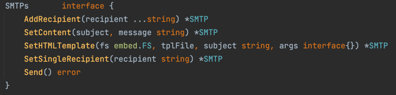

# phastos - go library

## Features


### [API apps](https://github.com/kodekoding/phastos/tree/master/go/api)
- Auto Connect to DB (MySQL | Postgres) and/or redis (redigo) cache* 
- Autoload notification platform (telegram | slack)*
- Auto Set CORS configuration**
- Gracefully Shutdown
- Custom HTTP Error
- Support versioning API
- Health-check endpoint (/ping)
- Notification on started/stopped service
  - 
- Wrapper handler
  - Panic recover
  - Binding Resource From Body (Payload) request to struct + Validation
  - Auto set timeout 3s**
  - Sent notification (telegram | slack) if error 500 is triggered from apps
  - Metric to new relic (soon)
- Auto create swagger docs (soon)
  
```
notes:
* if the configuration (.env key) is exists
** (configurable by using `.env`)
```

### [Caches](https://github.com/kodekoding/phastos/tree/master/go/cache)
- Connect to redis cache with library redigo with configuration by `.env`
- interface definition
  - 

### [Database / Query Builder](https://github.com/kodekoding/phastos/tree/master/go/database)
- Support RDBMS (MySQL + PostgreSQL)
  - support Oracle DB (soon)
- Connect to database with configuration by `.env`
- interface definition
  - Read
    - 
  - Write
    - 
  - Table Request struct
    - 
  - CUDResponse struct
    - 
- Support CRUD operations (Insert, Update, Delete, Get) direct with struct
  - Support Batch operations (experimental)
- Support Upsert (Update Insert) Process
- Support Count Process
- Support Soft Delete Process
- Support Pagination

### [Upload File to Cloud Services](https://github.com/kodekoding/phastos/tree/master/go/storage)
- supports GCS + AWS (soon)
- interface definition
  - 
- Upload/Download File direct to/from bucket
- Upload/Download File to/from bucket by SignedURL (with timeout)

### [Generator Helper](https://github.com/kodekoding/phastos/tree/master/go/generator)
- CSV generator
- Excel Generator
- PDF Generator (need to download and install library [wkhtmltopdf](https://wkhtmltopdf.org/downloads.html))
- QR Code generator
- Banner Image Generator

### [Importer Helper](https://github.com/kodekoding/phastos/tree/master/go/importer)
- CSV Import Data Process
- Excel Import Data Process

### [Mail Helper](https://github.com/kodekoding/phastos/tree/master/go/mail)
- Support mandrill + SMTP
- interface definition
  - Mandrill
    - 
  - SMTP
    - 

### [Auth Middleware Helper](https://github.com/kodekoding/phastos/tree/master/go/middleware)
- Support JWT + static auth
- store the JWT Claims data to context